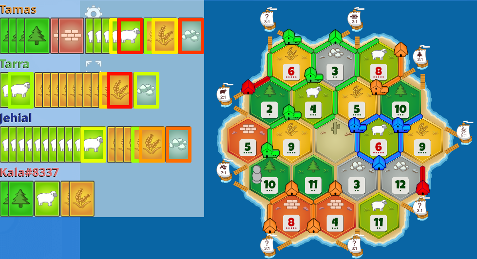
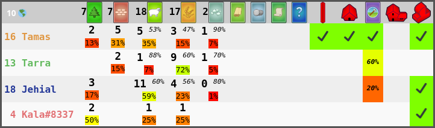

<!-- Lists and tables are longer -->
<!-- markdownlint-disable line-length -->

#  Correctly correlated Catan card chance Counter



## Features

|       |                               |
|------:|:------------------------------|
| 🂠     | Track cards                   |
| 🎲    | Analyze dice rolls            |
| 🥷    | Record robs                   |
| 👀    | Spectate games                |
| ∫     | Bayesian tracking algorithm   |
| 💡    | Include manual deductions     |
| 🤝    | Auto-trade (experimental)     |

| Correctly correlate card counts | Display dense dice data | Rightfully revenge ridiculous robs |
| :-: | :-: | :-: |
|  |  |  |

## Getting started

1. [Linux download](#linux-download) or [Manual download](#manual-download)
2. [Installation](#installation)
3. Reload [Colonist][Colonist] after installing Cocaco

Done!

---

### Requirements

- Firefox browser

### Linux download

```bash
#!/usr/bin/env bash
git clone https://github.com/Lolligerhans/cocaco.git &&
cd cocaco &&
git checkout "$(git describe --tags --abbrev=0)";
```

### Manual download

1. Download the newest version as `.zip` file from
[GitHub](https://github.com/Lolligerhans/cocaco/tags).
1. Extract the `.zip` file, producing the `cocaco/` folder.

<!-- > [!NOTE] -->
<!-- > Version 4 supports base game only. Use version 3 for expansions. -->

### Installation

Install as [temporary extension](https://extensionworkshop.com/documentation/develop/temporary-installation-in-firefox/ "Tutorial") in Firefox:

- Visit URL [`about:debugging#/runtime/this-firefox`](about:debugging#/runtime/this-firefox)
- Temporary Extensions
- Load Temporary Add-on...
- Select `cocaco/manifest.json`

<!--Chrome worked in the Game Log version, but socket is FF only.-->
<!-- - [Chrome](https://www.cnet.com/tech/services-and-software/how-to-install-chrome-extensions-manually/ "Tutorial") -->
<!--   - Visit URL [chrome://extensions/](chrome://extensions/) -->
<!--   - Enable developer mode -->
<!--   - Load unpacked -->
<!--   - Select the 'cocaco/' directory. (The inner one if there are two.) -->

> [!TIP]
> Bookmark the URL to repeat these steps more easily after restarting the
> browser.

<!-- > Firefox does not allow permanent installation of local extensions -->
<!-- > (developer versions may allow it). -->

## Instructions

See [doc/instructions.md](doc/instructions.md) for instructions. Use
[Q&A](https://github.com/Lolligerhans/cocaco/discussions/categories/q-a?discussions_q=)
for help.

## Attribution

<!-- <a href="https://www.flaticon.com/free-icons/food-and-restaurant" title="food and restaurant icons"> Food and restaurant icons created by @mingyue - Flaticon</a>  -->
| Resource/Module | Attribution |
| -: | :- |
| Inspiration | [Explorer][Explorer] which we [forked][Original] under the same name up to version 3 |
| Diagram plots | [Plotly][Plotly] |
| Icon | [Food and restaurant icons created by @mingyue - Flaticon](https://www.flaticon.com/free-icons/food-and-restaurant "food and restaurant icons") |
| MessagePack (de)serialization | [msgpack.js][MessagePack] |
| statistics.js/ | [statistics.js](https://thisancog.github.io/statistics.js/index.html "Documentation") |

<!--
 !  ╭─────────────────────────────────────────────────────────────────────────╮
 !  │ Link collection                                                         │
 !  ╰─────────────────────────────────────────────────────────────────────────╯
-->

[Colonist]: https://colonist.io/ "Colonist homepage"
[Explorer]: https://github.com/glasperfan/explorer "Explorer repository"
[Original]: https://github.com/Lolligerhans/explorer "Old fork"
[Plotly]: https://plotly.com/javascript/ "Plotly homepage"
[MessagePack]: https://github.com/ygoe/msgpack.js "GitHub repository"
